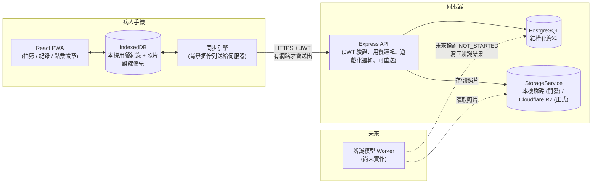

# 系統架構說明

這份文件說明整個 App 的技術架構、為什麼這樣選型，以及未來要接上「食物辨識模型」
時應該怎麼接。資料庫欄位層級的詳細說明另外寫在 [DATABASE.md](./DATABASE.md)，
正式環境部署步驟寫在 [DEPLOY.md](./DEPLOY.md)。

## 一句話總覽

**PWA 前端（離線優先：本機先存、背景同步）→ Express API（驗證、業務邏輯）→ PostgreSQL（結構化資料）+ 儲存服務（照片，本機磁碟或 Cloudflare R2）**



**跟最初版本最大的差別**：以前拍完照要馬上連上伺服器才算數；現在拍照永遠先存進
手機（`IndexedDB`），畫面立刻回應，有沒有網路都一樣能繼續記錄下一餐，背景的
「同步引擎」再找機會把資料送給伺服器。詳見下方「離線優先設計」。

## 為什麼選這個技術棧

這個專案的優先目標是「快速做出可以展示、可以真的拍照紀錄的 App」，同時保留研究
用資料庫的擴充性，所以選擇：

| 選型 | 用了什麼 | 為什麼 |
|---|---|---|
| 前端平台 | **PWA**（React + Vite + TypeScript，`vite-plugin-pwa`） | 不用上架 App Store/Play Store 就能讓病人「加到主畫面」像 App 一樣使用；瀏覽器的相機 API 就能直接叫出手機相機，開發與展示都最快。同一份程式碼未來也是包成 Capacitor 原生 App（見「離線優先設計」與 Android 上架規劃）的起點 |
| 後端 | **Node.js + Express + TypeScript** | 生態成熟、開發速度快，跟前端共用 TypeScript 型別觀念，降低專題團隊的學習成本 |
| 資料庫 | **PostgreSQL + Prisma ORM** | 關聯式資料庫最適合這種「病人-用餐-照片-辨識結果」高度結構化、彼此有明確關聯的資料；Prisma 讓 schema 即文件、migration 自動產生，也方便未來老師/口委看 schema 就懂資料設計 |
| 照片儲存 | **`StorageService` 介面，兩種實作**：本機磁碟（開發用）、**Cloudflare R2**（正式環境用，已實作） | 業務邏輯只認得介面（`save` / `read` / `getSignedReadUrl`），不需要知道實際存在哪裡；正式環境設 `STORAGE_DRIVER=r2`，後端幫每張照片簽發短效直連網址，讓瀏覽器直接跟 R2 拿檔案，照片流量不經過後端主機、也不用付流量費（見 `backend/src/services/storage.service.ts`） |
| 本機開發環境 | **原生安裝 Node.js + PostgreSQL**，用 `start-dev.ps1` 一鍵啟動 | 原本規劃用 Docker Compose，但 Windows 上的 Docker Desktop 遇到一個持續性的系統 bug（AF_UNIX socket reparse point）導致完全無法啟動，且排查多種方式都無法解決，所以改成原生安裝：PostgreSQL 用使用者自己的資料目錄（不透過 Windows 服務，繞開沒有系統管理員權限的限制），`start-dev.ps1` 依序啟動資料庫、後端、前端。`docker-compose.yml` 還留在專案裡，換到 Linux/Mac 或修好 Docker 的環境時可以直接用 |
| 正式環境部署 | **Render（後端）+ Neon（PostgreSQL）+ Cloudflare R2（照片）+ Cloudflare Pages（前端）** | 都有可用的免費/低價方案，前後端分離部署，細節與費用試算見 [DEPLOY.md](./DEPLOY.md) |

## 資料夾結構

```
claude_app/
├─ start-dev.ps1            # 本機開發：啟動 PostgreSQL + 後端 + 前端 (取代 Docker)
├─ docker-compose.yml       # 保留給 Docker 環境正常的電腦使用，本機開發預設不用
├─ render.yaml              # Render Blueprint，正式環境部署設定
├─ docs/                    # 這份文件、資料庫設計、部署手冊
├─ backend/
│  ├─ prisma/schema.prisma  # 資料庫schema（唯一的資料表定義來源）
│  ├─ prisma/migrations/    # 版本化的資料庫變更紀錄
│  ├─ prisma/seed.ts        # 徽章目錄初始資料
│  ├─ scripts/              # 升級帳號角色、忘記密碼的端到端檢查
│  ├─ Dockerfile.prod       # 正式環境用的建置設定 (Render 用這個)
│  └─ src/
│     ├─ routes/            # HTTP 路由：auth / meals / photos / gamification / profile / staff
│     ├─ services/          # 商業邏輯：photo 處理、storage 抽象 (本機/R2)、寄信抽象、gamification 規則
│     ├─ utils/             # JWT 簽發/驗證、密碼重設代碼的產生與正規化
│     ├─ middleware/        # JWT 驗證、上傳限制、錯誤處理、rate limit
│     └─ index.ts           # Express app 進入點 (CORS 白名單、trust proxy)
└─ frontend/
   ├─ vitest.config.ts      # 前端自動化測試設定
   └─ src/
      ├─ pages/              # 登入/註冊/忘記密碼/首頁/新增用餐/月曆紀錄/個人頁/衛教師工具
      ├─ components/         # 拍照元件（含即時相機）、同步狀態列、徽章格、底部導覽列…
      ├─ api/                # 呼叫後端 API 的 client（JWT 自動 refresh、逾時、網路錯誤分類）
      ├─ offline/            # 離線優先的核心：本機儲存、同步引擎、合併邏輯 (見下方專節)
      ├─ trial/              # 試用模式：本機算點數/徽章、試用資料的存取 (見下方專節)
      ├─ native/             # 只在原生 App 裡才有作用的功能（存照片到手機相簿）
      ├─ store/              # 前端狀態（登入狀態、Toast 提示、同步狀態）
      └─ test/                # 測試用的假後端、測試環境設定
```

## 認證機制

- Email + 密碼註冊/登入，密碼用 bcrypt 雜湊。
- 簽發 **access token**（15 分鐘過期，存在 `localStorage`，每次 API 請求帶上）
  與 **refresh token**（30 天過期，存在資料庫 `refresh_tokens` 表，可被撤銷、
  一次性使用）。
- access token 過期時，前端 API client 會自動用 refresh token 換一組新的，使用者
  不會感覺到中斷；好幾個請求同時 401 只會觸發一次 refresh（用共用的 in-flight
  promise），避免 refresh token 是一次性的特性造成互相搶著登出。
- **换發失敗時的判斷很重要**：只有伺服器明確拒絕（400/401/403，代表這個
  refresh token 真的失效了）才會登出；連不上網路、或伺服器暫時性錯誤
  （5xx/429）都不會登出，因為病人手機裡可能還有排隊等待上傳的離線紀錄，
  貿然登出會讓這些資料失去自動補傳的機會（仍然保留在本機，重新登入後會繼續）。
- `User.role` 欄位預留 `RESEARCHER` / `ADMIN` 角色，之後要做「研究人員後台」查看多位病人資料時，
  不需要改資料庫 schema，只要在對應 API 加上角色檢查即可。

## 忘記密碼

病人忘記密碼時有兩條路，**兩條最後都走到同一組機制**：產生一次性代碼 → 驗證代碼 → 換密碼。
差別只在代碼怎麼送到病人手上。

| | 病人自己申請 | 衛教師代開 |
|---|---|---|
| 入口 | App 登入頁「忘記密碼？」 | 衛教師的「🔑 協助病人重設密碼」 |
| 代碼怎麼給 | 寄到註冊的信箱 | 當面唸給病人 |
| 身分怎麼驗 | 他收得到那個信箱的信 | 當面看到本人 |
| 適用 | 一般情況 | 信箱進不去、或根本不收信的病人 |

**為什麼一定要有第二條路**：年長病人的信箱常常是家人幫忙申請的，密碼早就忘了，
或者根本不會去收信。只做 email 重設，這些病人就永久被鎖在外面了。而他們本來就會回診，
當面確認身分其實比任何線上驗證都強。

### 代碼的形式

10 個字元，顯示成 `XXXXX-XXXXX`。字母表刻意去掉 `0/O`、`1/I/L` 這些唸起來、看起來會混淆的字元，
剩 31 個 → 31^10 ≈ 8.2×10^14（約 49.5 bits）。

為什麼不是網址裡的長 token：衛教師要**唸**給病人聽、病人要**打**進 App，64 個十六進位字元
做不到這件事。而且 App 裡的網頁是從裝置本機載入的，信件裡的網址本來就打不開 App——
打代碼反而是這個情境下最直接的做法（信裡仍然會附網址，給用網頁版的人）。

輸入時會正規化（去空白、去連字號、轉大寫），病人怎麼打都能過。

### 安全上的決定

每一條都對應一種實際會發生的狀況：

- **資料庫只存代碼的 sha256。** 資料庫備份外流時，光有這張表不能重設任何人的密碼。
- **`/auth/forgot-password` 不論信箱存不存在都回 204。** 否則任何人都能拿它逐一測試
  「某某人是不是這個腎臟病研究的受試者」——那是會洩漏病情的資訊。連寄信都不等它完成
  就先回應，免得「有帳號的請求比較慢」變成另一條線索。
- **同一個帳號同時只有一組有效代碼。** 病人常連按好幾次「忘記密碼」，每次都開新的而舊的
  還能用，等於憑空多出好幾把鑰匙。
- **重設成功後撤銷該帳號所有 refresh token。** 如果密碼是被別人猜到才需要重設，那個人手上的
  登入狀態必須一起失效。病人自己的手機會被登出，但**本機還沒上傳的紀錄不會不見**——
  重新登入後同步引擎會接著傳。
- **代碼無效 / 已用過 / 已過期回同一句話。** 分開講的話，可以靠錯誤訊息確認「這組代碼曾經存在」。
- **速率限制**：申請 5 次/小時/IP、送出代碼 10 次/15 分鐘/IP。

### 角色不能自助申請

註冊一律是 `PATIENT`。要變成 `RESEARCHER` / `ADMIN` 只能由管理者在伺服器上執行
`npm run grant-role -- <email> RESEARCHER`，所以不存在「有人靠 API 把自己變成研究人員」
的可能。權限寫在 access token 裡，**改完角色要重新登入才會生效**。

前端會隱藏一般病人看不到的畫面，但那只是體感——真正的檢查在後端的 `requireRole`。

### 寄信

`MAIL_DRIVER=console` 把信印在後端 log（開發用，不需要任何帳號就能把流程跑完）；
`MAIL_DRIVER=resend` 走 Resend 的 HTTP API（正式用）。選 Resend 是因為它是純 HTTP，
Node 內建的 fetch 就能打，**不必多裝任何套件**；要改用學校/醫院自己的 SMTP 主機的話，
在 `services/mailer.service.ts` 多一個實作類別即可。

### 驗證

`npm run check:password-reset` 會自己起一個後端、跑 34 項端到端檢查（含帳號列舉、
代碼重放、過期、權限、速率限制等惡意情境）、再把測試帳號清乾淨。改動這一塊之後請跑一次。

## 試用模式（不需要伺服器、不需要帳號）

**問題**：要請護理師/衛教師幫忙試用、找出介面上的問題時，後端往往還沒有固定位置。
如果 App 一打開就要求「填後端網址 → 註冊帳號 → 登入」，光這三步就會擋掉大部分的人，
而且他們回報的會是「連不上」，不是我們真正想知道的使用問題。

**做法**：App 第一次開啟的「開始使用」畫面提供兩條路——**直接試用** 或 **連到伺服器**。
選了直接試用之後，整個 App 照常運作，只是所有資料都留在這支手機。

| | 正常模式 | 試用模式 |
|---|---|---|
| 進入方式 | 填後端網址 → 註冊/登入 | 按一下「直接試用」 |
| 使用者 | 真實帳號 | 固定的假 id `trial-local-user` |
| 紀錄存在哪 | 手機 IndexedDB + 伺服器 | 只在手機 IndexedDB |
| 同步引擎 | 啟動 | **完全不啟動** |
| 點數/連續天數/徽章 | 伺服器算 | 手機自己算（`trial/gamification.ts`） |
| 健康資料 | 伺服器 `PatientProfile` | `localStorage` |

### 怎麼保證試用資料不會外流

還沒通過 IRB 之前，試用者拍的照片絕對不能跑到伺服器上。程式裡有三道各自獨立的防線：

1. `requestSync()` 在最前面就判斷試用模式直接返回，同步引擎根本不會被啟動
   （`App.tsx` 也不會呼叫 `startSyncEngine()`）。
2. 試用模式沒有 access token，就算同步引擎被啟動也會停在「未登入」。
3. 試用紀錄掛在固定的假 `userId` 底下，而同步是依「目前登入帳號的 id」撈資料，
   所以就算真的跑起來也撈不到試用資料。

這幾條在 `trial/trialMode.test.ts` 有測試守著（包含「請求同步時一個 API 都不會發出」）。

### 為什麼點數規則會有兩份

`trial/gamification.ts` 是 `backend/src/services/gamification.service.ts` 的翻版。
明知重複還是這樣做，是因為試用模式若把點數永遠顯示成 0，護理師會把它當成 bug 回報，
我們想問的「介面好不好用」就問不到了。

重複的代價是會走鐘，所以 `trial/gamification.test.ts` 裡有兩個測試直接去讀後端的
`seed.ts` 與 `gamification.service.ts`，比對徽章目錄與點數常數；
**只要有人改了後端而沒改前端，前端測試就會紅**。

本機的算法是「把所有已完成的紀錄依餐後照時間由早到晚重播一次」，而不是直接統計，
因為連續天數、當日全勤、里程碑徽章都跟發生順序有關，重播才會跟後端逐筆處理
上傳佇列的結果一致。

### 結束試用之後

「我的」頁面有「結束試用」（回到開始使用畫面，紀錄留著）與「清除試用紀錄」
（把這支手機上的試用資料清掉，換下一位測試者接手用）。兩者都不會動到真實帳號的資料。

## 一次用餐的完整流程（核心功能）

1. 病人在首頁按「開始記錄一餐」→ 選擇餐別（早/中/晚/點心）→ 拍**餐前照**
   （即時相機預覽，或改選「從相簿選擇」）。
2. 這一步**先寫進手機本機**（`IndexedDB`），不需要網路就會成功，前端立刻產生
   這筆紀錄的 UUID 並顯示「等待餐後照」。接著在背景嘗試上傳：連得上網路的話，
   幾秒內就會看到點數/徽章更新；連不上就顯示「已安全存在手機裡，連上網路後
   會自動上傳」，資料不會遺失。
3. 病人吃完飯後回到 App，看到首頁「進行中的用餐」卡片（會顯示已經過了多久），
   按「拍餐後照」→ 一樣先存進本機，計算 `postMealAt - preMealAt` 得到
   **用餐時長**（這一步不需要等伺服器，本機就能算出來給病人看）。
4. 背景同步引擎依「拍照/操作發生的時間」把所有裝置上還沒上傳的動作排成一條
   佇列，逐一送給伺服器；伺服器收到後計算正式的點數、連續天數、徽章。
5. 所有拍過的照片都能在「紀錄」頁回顧。這一頁是**月曆**：一個月一眼看完哪幾天
   有記錄、哪幾天漏掉（跟連續天數的設計呼應），點進某一天再看那天每一餐的
   餐前/餐後照片。離線時顯示本機縮圖，連上網路後才需要跟伺服器要原始檔。

## 離線優先設計（frontend/src/offline/）

**問題**：病人拍完餐前照後，常常要移動（走去用餐區、搭電梯、醫院地下室），
這段時間手機可能斷線或訊號不穩；原本的設計要求兩次拍照都要能連上伺服器，
一旦中間斷線，這筆用餐紀錄就會卡住甚至遺失。

**做法**：把「存資料」跟「傳給伺服器」拆成兩個獨立的步驟。

### 前端的本機儲存

- 拍照後的照片與紀錄先寫進手機的 `IndexedDB`（`offline/db.ts`），這是整個
  離線層唯一知道「底層是 IndexedDB」的地方——未來包成 Capacitor 原生 App、
  想換成 SQLite，只需要改這一個檔案和 `offline/mealStore.ts`，其餘程式碼
  （同步邏輯、頁面）完全不用動。
- 讀取-修改-寫回一定在同一個 IndexedDB transaction 裡完成，避免「同步引擎
  正在上傳」跟「使用者同時按了放棄」互相覆蓋對方的修改。

### 同步引擎怎麼決定「何時上傳」「上傳順序」

- 觸發時機：App 啟動、本機有新動作、網路恢復（`online` 事件）、App 回到前景、
  佇列還有東西時每 30 秒輪詢一次、重新登入後、使用者手動按「立即上傳」。
- **上傳順序不是「一筆一筆」，而是把所有裝置上還沒上傳的動作（餐前照、
  餐後照、放棄、刪除）全部攤平、依「動作實際發生的時間」排成一條佇列**。
  原因：後端的連續天數是依「用餐日期」累加，且**不接受比上次記錄還早的
  日期**。如果病人在第 1 天深夜拍了餐前照、卻拖到第 3 天才補拍餐後照，
  同時第 2 天有一筆完整的紀錄——如果先送出第 3 天那筆的餐後照，連續天數
  會先被推到第 3 天，第 2 天那筆就再也算不進去了。依時間排序上傳可以避免
  這個問題（詳見 `offline/logic.ts` 的 `buildEvents`，以及對應的測試案例）。

### 跟後端的約定：可以安全重送

同步引擎隨時可能因為斷線而不知道「剛剛那個請求伺服器到底收到了沒」，重送
是唯一安全的做法，所以後端（見 `backend/src/routes/meals.routes.ts`）被設計
成可以放心重送：

- 用餐紀錄的 ID 由**前端產生**（UUID），不是等伺服器回傳才知道，離線時也
  能立刻建立一筆完整可用的紀錄。
- 同一個 ID、同一張照片（用內容雜湊比對）重送，伺服器回 200 附上原本的結果，
  不會重複建立、不會重複發點數；資料庫的 `unique(mealRecordId, phase)` 限制
  是最後一道防線。
- 伺服器如果做到一半中斷（例如照片存好了但點數還沒發），下一次重送會自動
  從中斷的地方接著做完，而不是報錯或重來。

### 錯誤分類決定下一步（`offline/logic.ts` 的 `classifyError`）

| 情況 | 反應 |
|---|---|
| 連不上網路 / 逾時 | 整條佇列停下來，之後自動重試 |
| 登入失效（401） | 整條佇列停下來，等病人重新登入 |
| 伺服器忙碌（429 / 5xx，含 Cloudflare tunnel 斷線的 520~530） | 整條佇列停下來，稍後自動重試 |
| 單一這筆一直回 5xx | 只跳過這一筆（不擋住其他紀錄），指數退避重試；連續 5 次**且**超過 30 分鐘才暫停下來等人處理（避免伺服器短暫重啟就把照片卡住） |
| 伺服器明確拒絕（400/403/409 等） | 這筆標記失敗，顯示原因，病人可以在「紀錄」頁選擇重試或捨棄 |
| 放棄/刪除時伺服器說「找不到」或「狀態不對」 | 視為目的已達成，不當成錯誤 |

失敗的紀錄會清楚顯示在「紀錄」頁，病人不需要看到任何技術術語，只會看到
「已安全存在手機裡」或「上傳失敗，請重試」這類白話說明。

### 照片壓縮（`offline/util.ts` 的 `compressImage`）

拍照後、寫進 IndexedDB 之前就先壓成**最長邊 1600px、JPEG 品質 0.82**，所以手機容量、
上傳流量、伺服器儲存三邊同時受惠。

**為什麼一定要做**：離線模式下照片要留在手機裡直到下次連上伺服器。若病人是
「回診時才同步」（例如後端架在醫院內網），以原始 4K 照片計算：

| 回診間隔 | 壓縮前 | 壓縮後 |
|---|---|---|
| 一週（洗腎病人） | 約 130MB | 約 9MB |
| 三個月（一般門診） | 約 1.6GB | 約 110MB |

年長病人常用的入門機放不下 1.6GB，所以這在「回診同步」的架構下是必要條件，不是優化。

**為什麼是 1600px**：食物辨識模型的輸入通常在 224~640px，1600px 有充足餘裕；
再高只是浪費病人的儲存空間與流量。實測 4K 照片 2.76MB → 184KB（約 15 倍）。

**附帶效果**：用 canvas 重新編碼會把原始 EXIF 整段丟掉，其中包含 GPS 座標——
等於同時完成了「照片去識別化」這項 IRB 前置工作（已用內嵌 GPS 的測試檔驗證過）。
但這也代表**未來若要改用 EXIF 的拍攝時間，必須在壓縮之前讀取**。

任何一步失敗（例如瀏覽器解不開 HEIC）都會退回使用原始檔案——寧可佔空間，
也不要讓病人的照片上傳不了。

### 測試

`frontend/src/offline/`、`frontend/src/api/client.ts` 與 `frontend/src/trial/`
有完整的自動化測試（`vitest` + `fake-indexeddb`，共 135 個案例，`npm test` 執行），涵蓋：
佇列排序（含連續天數的邊界情況）、每一種錯誤分類、重送不會重複、多天離線
累積後一次補傳、同步過程中使用者又有新動作、token 換發等情境；試用模式的部分則守著
「不會發出任何 API 請求」「試用資料跟真實帳號分開」以及「點數規則沒有跟後端走鐘」。這些自動化
測試之外，也用真實瀏覽器 + 真實後端做過端到端驗證（離線建立、斷網重連後
自動補傳、拒絕上傳時不留孤兒紀錄）。

## 打包成 Android App（Capacitor）

`frontend/android/` 是 Capacitor 產生的 Android 專案，把同一份前端網頁包進 APK，
**沒有另外寫一份 App 程式**。打包指令與注意事項見 [README](../README.md#打包-android-apk)。

幾個設計上的決定：

- **`appId` 是 `tw.edu.project.kidneydiet`，發佈後絕對不能改**。Android 用它辨識
  「是不是同一個 App」，改掉就變成另一個 App、無法覆蓋安裝；而要求病人先解除安裝，
  會連帶清掉手機裡還沒上傳的離線紀錄。
- **必須宣告 `CAMERA` 權限**。拍照走的是網頁的 `getUserMedia`，在 WebView 裡沒有
  這個權限會直接失敗（第一次打包時就踩到這個問題）。「從相簿選擇」走系統檔案選擇器，
  不需要額外權限。
- **後端要放行 Capacitor 的來源**。App 裡的網頁是從裝置本機載入的，`Origin` 會是
  `https://localhost`（Android）或 `capacitor://localhost`（iOS），這幾個值已加進
  後端的 CORS 白名單。
- **App 內不允許明文 http 連線**。Android 9 以上預設就封鎖，我們也沒有開例外——
  病人的照片與登入憑證不應該在 Wi-Fi 上裸奔。這代表**後端必須有 HTTPS**，
  想連區網內的 http 伺服器測試時要另外開例外（僅限測試）。
- **試用版 vs 正式版**：試用版讓使用者自己填後端網址（因為還沒有固定網址）；
  正式版用建置時的 `VITE_API_BASE_URL` 寫死，設定畫面就不會出現，跟一般 App 一樣。

## 照片另存到手機相簿（Android）

病人（和幫忙試用的護理師）會預期「用這個 App 拍的東西，我在相簿裡找得到」，就像用一般
相機 App 一樣。App 自己的資料庫存的照片只在 App 裡看得到，那不是他們認知中的「存在手機裡」。
所以**用 App 相機拍的照片會另存一份到相簿**（從相簿挑的不會，那本來就在裡面了）。

### 為什麼自己寫原生外掛

先試了現成的 `@capacitor-community/media`，兩個問題讓它不適用：

1. 它在 Android 10 以上是寫進 `getExternalMediaDirs()`——**App 專屬**的媒體資料夾。
   照片雖然會出現在相簿裡，但**解除安裝 App 時會被一起刪掉**。既然目的是「留給病人」，
   這個位置就不對。
2. 它的權限判斷要求 `WRITE_EXTERNAL_STORAGE`，而那個權限在 Android 11 之後根本不可能
   被授予（scoped storage），Android 10~12 的使用者會卡在永遠拿不到權限。

所以改成一個只有一個方法的自製外掛
[`PhotoGalleryPlugin.java`](../frontend/android/app/src/main/java/tw/edu/project/kidneydiet/PhotoGalleryPlugin.java)：

| Android 版本 | 做法 | 需要權限嗎 | 解除安裝後 |
|---|---|---|---|
| 10（API 29）以上 | 插入 `MediaStore`，`RELATIVE_PATH = Pictures/腎臟飲食紀錄` | **不需要** | 照片留著 |
| 9（API 28）以下 | 直接寫進公用 `Pictures/腎臟飲食紀錄`，再通知系統掃描 | `WRITE_EXTERNAL_STORAGE` | 照片留著 |

`WRITE_EXTERNAL_STORAGE` 在 manifest 裡標了 `maxSdkVersion="28"`，新版 Android 安裝時
就不會顯示一個其實用不到的儲存空間權限。自製外掛要在 `MainActivity.onCreate()` 裡用
`registerPlugin()` 手動註冊，而且必須在 `super.onCreate()` **之前**。

### 存的是壓縮後的版本

不是原始檔，理由有三個：

- 原始 4K 照片 2~4MB，轉成 base64 要 5MB 以上才能通過 Capacitor 的 JS↔原生橋接，
  入門機容易卡頓或記憶體不足。壓縮後約 200KB。
- 1600px 比任何手機螢幕都大，病人看不出差別，但省下約 15 倍空間。
- 壓縮會移除 EXIF，所以**相簿那份不含 GPS 座標**。相簿裡的照片多半會被 Google 相簿
  自動備份到雲端，帶著住家座標上雲不是我們要的結果。

代價是同一張照片壓兩次（一次給 App、一次給相簿）。兩次都從原始檔壓，沒有畫質疊加損失，
只是多花一點 CPU。要省掉的話，可以把「照片來源」一路傳到 `mealStore.buildSlot()`，
在那裡壓完順便存。

### 存相簿一律是「盡力而為」

沒權限、空間不足、系統拒絕，全部只會安靜地回 `false` 並寫一行 console，**絕不影響
病人記錄這一餐**——照片在 App 的資料庫裡已經是安全的。`frontend/src/native/photoGallery.test.ts`
守著兩件事：網頁版完全不會去呼叫，以及不論發生什麼都不會 throw。

⚠ **尚未在實體 Android 裝置上驗證。** 程式會編譯、外掛有被打包進 APK、權限也正確宣告，
但 MediaStore 的實際行為（相簿是否出現、檔名是否正確）需要實機確認。

## 遊戲化設計

規則全部集中在 `backend/src/services/gamification.service.ts`，方便之後調整：

- **點數**：拍餐前照 +10、完成餐後照 +15、一天內完成早午晚三餐 +20 bonus、
  達成連續天數里程碑另有加碼、獲得徽章 +25。所有加點都寫進 `PointsLedgerEntry`
  這張「只增不改」的事件表，總點數 = 加總，同時保留完整行為歷程。
- **連續天數（streak）**：依照病人裝置回報的時區，判斷「今天」是否已經完成過
  至少一餐，逐日累加或中斷重置，存在 `UserStreak`。這個計算對「日期倒退」很
  敏感（見上方離線優先設計的排序說明），也對裝置時鐘被調到未來做了防護
  （遊戲化計算用的時間不會晚於伺服器當下的時間，但資料庫仍保存裝置回報的
  原始時間供研究使用）。
- **徽章**：里程碑式設計（第一餐、連續3/7/14/30/60/100天、完美的一天、
  累計10/50/100/200餐、早餐達人…），由 `prisma/seed.ts` 建立徽章目錄，
  達成條件時寫入 `UserBadge`。
- 前端在完成餐後照時會比對「上傳前/上傳後」的徽章清單，抓出**新獲得**的徽章，
  用慶祝畫面呈現，並搭配每次都會換一句的鼓勵文案（純前端靜態內容，不用進資料庫）。
  離線完成時看不到即時點數（要等同步成功才知道伺服器算出的正確值），畫面會
  誠實顯示「已安全存在手機裡，連上網路後會自動上傳，並幫你算好點數和徽章」。

## 為未來的辨識功能預留了什麼

現在完全沒有寫任何辨識邏輯，但資料庫與 API 已經替未來鋪好路：

1. 每張 `Photo` 上傳時都會自動建立一筆 `NutritionEstimate`，狀態是 `NOT_STARTED`。
2. 未來選定模型後，只需要新增一個「背景 worker」：定期把 `NOT_STARTED` 的照片抓出來、
   丟給模型、把結果（鈉/鉀/磷/蛋白質/熱量、信心分數、原始輸出）寫回同一筆
   `NutritionEstimate`，狀態改成 `COMPLETED`（或失敗時 `FAILED`）。
3. 前端 / 既有 API 完全不需要改動，因為資料表與關聯已經存在；只是現在沒有東西會把
   狀態從 `NOT_STARTED` 改變而已。
4. `PatientProfile` 已經有每日鈉/鉀/磷攝取上限欄位，未來辨識出攝取量後，就可以直接
   拿來比對「今天有沒有超標」，不需要另外設計欄位。

## 尚未實作、但資料庫設計時已經考慮到的擴充方向

- **檢驗數據表（LabResult）**：未來若要收集病人的血液檢驗值（血鉀、血磷等）跟飲食
  紀錄做相關性分析，可以直接新增一張 `LabResult`（userId、抽血日期、各項數值），
  透過 `userId` 就能 join 到現有的 `MealRecord` / `NutritionEstimate`，不需要動到
  現有 schema。
- **研究人員後台**：`User.role` 已經有 `RESEARCHER`，未來要讓研究人員瀏覽/匯出多位
  病人的資料，只要新增對應的 API + 前端頁面，資料庫不需要遷移。
- **iOS App**：Android 版已經用 Capacitor 包好（見下方「打包成 Android App」），
  iOS 是同一份程式碼，需要 Mac、Xcode 與 Apple 開發者帳號（US$99/年，發放走 TestFlight）。
  離線層刻意跟 IndexedDB 的實作細節分開，就是為了之後想換成 Capacitor 的原生
  SQLite 外掛時，同步邏輯不用重寫。

## 已知限制

- **所有照片解析度一致**：壓縮後都是最長邊 1600px，因此無法再從收集到的資料研究
  「照片解析度是否影響辨識準確率」。若研究上需要這個變因，得另外記錄原始尺寸。
- **EXIF 拍攝時間要在壓縮前讀**：壓縮會把 EXIF 整段移除（見下方「照片壓縮」），
  未來若要改用 EXIF 的拍攝時間，程式順序不能弄反。
- **相簿選擇的照片時間戳記較不精確**：無法得知照片實際拍攝時間，只能用
  「病人選取那張照片的當下時間」近似，尚未實作 EXIF 拍攝時間解析。
- **多分頁/多裝置**：目前只用瀏覽器的 Web Locks API 避免「同一支手機開兩個
  分頁」同時上傳；不支援該 API 的舊瀏覽器則沒有這層保護（後端的重送保護
  仍然有效，只是可能多打幾次沒有意義的請求）。
- **完全離線冷啟動**尚未在真實裝置上驗證過（開發時用的內嵌瀏覽器無法測試
  Service Worker 完全離線啟動的情境），建議正式收案前用真實手機開飛航模式
  測試一次。
