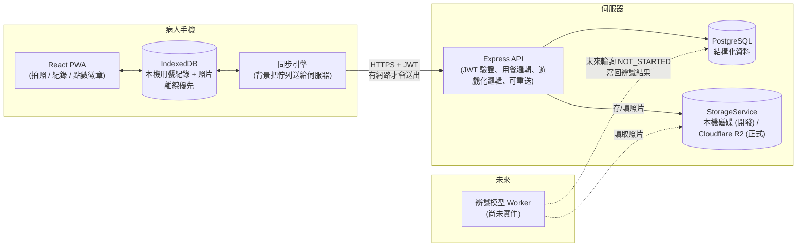

# 系統架構說明

這份文件說明整個 App 的技術架構、為什麼這樣選型，以及未來要接上「食物辨識模型」
時應該怎麼接。資料庫欄位層級的詳細說明另外寫在 [DATABASE.md](./DATABASE.md)，
正式環境部署步驟寫在 [DEPLOY.md](./DEPLOY.md)。

## 一句話總覽

**PWA 前端（離線優先：本機先存、背景同步）→ Express API（驗證、業務邏輯）→ PostgreSQL（結構化資料）+ 儲存服務（照片，本機磁碟或 Cloudflare R2）**



**跟最初版本最大的差別**：以前拍完照要馬上連上伺服器才算數；現在拍照永遠先存進
手機（`IndexedDB`），畫面立刻回應，有沒有網路都一樣能繼續記錄下一餐，背景的
「同步引擎」再找機會把資料送給伺服器。詳見下方「離線優先設計」。

## 為什麼選這個技術棧

這個專案的優先目標是「快速做出可以展示、可以真的拍照紀錄的 App」，同時保留研究
用資料庫的擴充性，所以選擇：

| 選型 | 用了什麼 | 為什麼 |
|---|---|---|
| 前端平台 | **PWA**（React + Vite + TypeScript，`vite-plugin-pwa`） | 不用上架 App Store/Play Store 就能讓病人「加到主畫面」像 App 一樣使用；瀏覽器的相機 API 就能直接叫出手機相機，開發與展示都最快。同一份程式碼未來也是包成 Capacitor 原生 App（見「離線優先設計」與 Android 上架規劃）的起點 |
| 後端 | **Node.js + Express + TypeScript** | 生態成熟、開發速度快，跟前端共用 TypeScript 型別觀念，降低專題團隊的學習成本 |
| 資料庫 | **PostgreSQL + Prisma ORM** | 關聯式資料庫最適合這種「病人-用餐-照片-辨識結果」高度結構化、彼此有明確關聯的資料；Prisma 讓 schema 即文件、migration 自動產生，也方便未來老師/口委看 schema 就懂資料設計 |
| 照片儲存 | **`StorageService` 介面，兩種實作**：本機磁碟（開發用）、**Cloudflare R2**（正式環境用，已實作） | 業務邏輯只認得介面（`save` / `read` / `getSignedReadUrl`），不需要知道實際存在哪裡；正式環境設 `STORAGE_DRIVER=r2`，後端幫每張照片簽發短效直連網址，讓瀏覽器直接跟 R2 拿檔案，照片流量不經過後端主機、也不用付流量費（見 `backend/src/services/storage.service.ts`） |
| 本機開發環境 | **原生安裝 Node.js + PostgreSQL**，用 `start-dev.ps1` 一鍵啟動 | 原本規劃用 Docker Compose，但 Windows 上的 Docker Desktop 遇到一個持續性的系統 bug（AF_UNIX socket reparse point）導致完全無法啟動，且排查多種方式都無法解決，所以改成原生安裝：PostgreSQL 用使用者自己的資料目錄（不透過 Windows 服務，繞開沒有系統管理員權限的限制），`start-dev.ps1` 依序啟動資料庫、後端、前端。`docker-compose.yml` 還留在專案裡，換到 Linux/Mac 或修好 Docker 的環境時可以直接用 |
| 正式環境部署 | **Render（後端）+ Neon（PostgreSQL）+ Cloudflare R2（照片）+ Cloudflare Pages（前端）** | 都有可用的免費/低價方案，前後端分離部署，細節與費用試算見 [DEPLOY.md](./DEPLOY.md) |

## 資料夾結構

```
claude_app/
├─ start-dev.ps1            # 本機開發：啟動 PostgreSQL + 後端 + 前端 (取代 Docker)
├─ docker-compose.yml       # 保留給 Docker 環境正常的電腦使用，本機開發預設不用
├─ render.yaml              # Render Blueprint，正式環境部署設定
├─ docs/                    # 這份文件、資料庫設計、部署手冊
├─ backend/
│  ├─ prisma/schema.prisma  # 資料庫schema（唯一的資料表定義來源）
│  ├─ prisma/migrations/    # 版本化的資料庫變更紀錄
│  ├─ prisma/seed.ts        # 徽章目錄初始資料
│  ├─ Dockerfile.prod       # 正式環境用的建置設定 (Render 用這個)
│  └─ src/
│     ├─ routes/            # HTTP 路由：auth / meals / photos / gamification / profile
│     ├─ services/          # 商業邏輯：photo 處理、storage 抽象 (本機/R2)、gamification 規則
│     ├─ middleware/        # JWT 驗證、上傳限制、錯誤處理、rate limit
│     └─ index.ts           # Express app 進入點 (CORS 白名單、trust proxy)
└─ frontend/
   ├─ vitest.config.ts      # 前端自動化測試設定
   └─ src/
      ├─ pages/              # 登入/註冊/首頁/新增用餐/歷史紀錄/個人頁
      ├─ components/         # 拍照元件（含即時相機）、同步狀態列、徽章格、底部導覽列…
      ├─ api/                # 呼叫後端 API 的 client（JWT 自動 refresh、逾時、網路錯誤分類）
      ├─ offline/            # 離線優先的核心：本機儲存、同步引擎、合併邏輯 (見下方專節)
      ├─ store/              # 前端狀態（登入狀態、Toast 提示、同步狀態）
      └─ test/                # 測試用的假後端、測試環境設定
```

## 認證機制

- Email + 密碼註冊/登入，密碼用 bcrypt 雜湊。
- 簽發 **access token**（15 分鐘過期，存在 `localStorage`，每次 API 請求帶上）
  與 **refresh token**（30 天過期，存在資料庫 `refresh_tokens` 表，可被撤銷、
  一次性使用）。
- access token 過期時，前端 API client 會自動用 refresh token 換一組新的，使用者
  不會感覺到中斷；好幾個請求同時 401 只會觸發一次 refresh（用共用的 in-flight
  promise），避免 refresh token 是一次性的特性造成互相搶著登出。
- **换發失敗時的判斷很重要**：只有伺服器明確拒絕（400/401/403，代表這個
  refresh token 真的失效了）才會登出；連不上網路、或伺服器暫時性錯誤
  （5xx/429）都不會登出，因為病人手機裡可能還有排隊等待上傳的離線紀錄，
  貿然登出會讓這些資料失去自動補傳的機會（仍然保留在本機，重新登入後會繼續）。
- `User.role` 欄位預留 `RESEARCHER` / `ADMIN` 角色，之後要做「研究人員後台」查看多位病人資料時，
  不需要改資料庫 schema，只要在對應 API 加上角色檢查即可。

## 一次用餐的完整流程（核心功能）

1. 病人在首頁按「開始記錄一餐」→ 選擇餐別（早/中/晚/點心）→ 拍**餐前照**
   （即時相機預覽，或改選「從相簿選擇」）。
2. 這一步**先寫進手機本機**（`IndexedDB`），不需要網路就會成功，前端立刻產生
   這筆紀錄的 UUID 並顯示「等待餐後照」。接著在背景嘗試上傳：連得上網路的話，
   幾秒內就會看到點數/徽章更新；連不上就顯示「已安全存在手機裡，連上網路後
   會自動上傳」，資料不會遺失。
3. 病人吃完飯後回到 App，看到首頁「進行中的用餐」卡片（會顯示已經過了多久），
   按「拍餐後照」→ 一樣先存進本機，計算 `postMealAt - preMealAt` 得到
   **用餐時長**（這一步不需要等伺服器，本機就能算出來給病人看）。
4. 背景同步引擎依「拍照/操作發生的時間」把所有裝置上還沒上傳的動作排成一條
   佇列，逐一送給伺服器；伺服器收到後計算正式的點數、連續天數、徽章。
5. 所有拍過的照片都能在「紀錄」頁用縮圖回顧（離線時顯示本機縮圖，連上網路
   後才需要跟伺服器要原始檔）。

## 離線優先設計（frontend/src/offline/）

**問題**：病人拍完餐前照後，常常要移動（走去用餐區、搭電梯、醫院地下室），
這段時間手機可能斷線或訊號不穩；原本的設計要求兩次拍照都要能連上伺服器，
一旦中間斷線，這筆用餐紀錄就會卡住甚至遺失。

**做法**：把「存資料」跟「傳給伺服器」拆成兩個獨立的步驟。

### 前端的本機儲存

- 拍照後的照片與紀錄先寫進手機的 `IndexedDB`（`offline/db.ts`），這是整個
  離線層唯一知道「底層是 IndexedDB」的地方——未來包成 Capacitor 原生 App、
  想換成 SQLite，只需要改這一個檔案和 `offline/mealStore.ts`，其餘程式碼
  （同步邏輯、頁面）完全不用動。
- 讀取-修改-寫回一定在同一個 IndexedDB transaction 裡完成，避免「同步引擎
  正在上傳」跟「使用者同時按了放棄」互相覆蓋對方的修改。

### 同步引擎怎麼決定「何時上傳」「上傳順序」

- 觸發時機：App 啟動、本機有新動作、網路恢復（`online` 事件）、App 回到前景、
  佇列還有東西時每 30 秒輪詢一次、重新登入後、使用者手動按「立即上傳」。
- **上傳順序不是「一筆一筆」，而是把所有裝置上還沒上傳的動作（餐前照、
  餐後照、放棄、刪除）全部攤平、依「動作實際發生的時間」排成一條佇列**。
  原因：後端的連續天數是依「用餐日期」累加，且**不接受比上次記錄還早的
  日期**。如果病人在第 1 天深夜拍了餐前照、卻拖到第 3 天才補拍餐後照，
  同時第 2 天有一筆完整的紀錄——如果先送出第 3 天那筆的餐後照，連續天數
  會先被推到第 3 天，第 2 天那筆就再也算不進去了。依時間排序上傳可以避免
  這個問題（詳見 `offline/logic.ts` 的 `buildEvents`，以及對應的測試案例）。

### 跟後端的約定：可以安全重送

同步引擎隨時可能因為斷線而不知道「剛剛那個請求伺服器到底收到了沒」，重送
是唯一安全的做法，所以後端（見 `backend/src/routes/meals.routes.ts`）被設計
成可以放心重送：

- 用餐紀錄的 ID 由**前端產生**（UUID），不是等伺服器回傳才知道，離線時也
  能立刻建立一筆完整可用的紀錄。
- 同一個 ID、同一張照片（用內容雜湊比對）重送，伺服器回 200 附上原本的結果，
  不會重複建立、不會重複發點數；資料庫的 `unique(mealRecordId, phase)` 限制
  是最後一道防線。
- 伺服器如果做到一半中斷（例如照片存好了但點數還沒發），下一次重送會自動
  從中斷的地方接著做完，而不是報錯或重來。

### 錯誤分類決定下一步（`offline/logic.ts` 的 `classifyError`）

| 情況 | 反應 |
|---|---|
| 連不上網路 / 逾時 | 整條佇列停下來，之後自動重試 |
| 登入失效（401） | 整條佇列停下來，等病人重新登入 |
| 伺服器忙碌（429 / 5xx，含 Cloudflare tunnel 斷線的 520~530） | 整條佇列停下來，稍後自動重試 |
| 單一這筆一直回 5xx | 只跳過這一筆（不擋住其他紀錄），指數退避重試；連續 5 次**且**超過 30 分鐘才暫停下來等人處理（避免伺服器短暫重啟就把照片卡住） |
| 伺服器明確拒絕（400/403/409 等） | 這筆標記失敗，顯示原因，病人可以在「紀錄」頁選擇重試或捨棄 |
| 放棄/刪除時伺服器說「找不到」或「狀態不對」 | 視為目的已達成，不當成錯誤 |

失敗的紀錄會清楚顯示在「紀錄」頁，病人不需要看到任何技術術語，只會看到
「已安全存在手機裡」或「上傳失敗，請重試」這類白話說明。

### 測試

`frontend/src/offline/` 與 `frontend/src/api/client.ts` 有完整的自動化測試
（`vitest` + `fake-indexeddb`，共 100 多個案例，`npm test` 執行），涵蓋：
佇列排序（含連續天數的邊界情況）、每一種錯誤分類、重送不會重複、多天離線
累積後一次補傳、同步過程中使用者又有新動作、token 換發等情境。這些自動化
測試之外，也用真實瀏覽器 + 真實後端做過端到端驗證（離線建立、斷網重連後
自動補傳、拒絕上傳時不留孤兒紀錄）。

## 遊戲化設計

規則全部集中在 `backend/src/services/gamification.service.ts`，方便之後調整：

- **點數**：拍餐前照 +10、完成餐後照 +15、一天內完成早午晚三餐 +20 bonus、
  達成連續天數里程碑另有加碼、獲得徽章 +25。所有加點都寫進 `PointsLedgerEntry`
  這張「只增不改」的事件表，總點數 = 加總，同時保留完整行為歷程。
- **連續天數（streak）**：依照病人裝置回報的時區，判斷「今天」是否已經完成過
  至少一餐，逐日累加或中斷重置，存在 `UserStreak`。這個計算對「日期倒退」很
  敏感（見上方離線優先設計的排序說明），也對裝置時鐘被調到未來做了防護
  （遊戲化計算用的時間不會晚於伺服器當下的時間，但資料庫仍保存裝置回報的
  原始時間供研究使用）。
- **徽章**：里程碑式設計（第一餐、連續3/7/14/30/60/100天、完美的一天、
  累計10/50/100/200餐、早餐達人…），由 `prisma/seed.ts` 建立徽章目錄，
  達成條件時寫入 `UserBadge`。
- 前端在完成餐後照時會比對「上傳前/上傳後」的徽章清單，抓出**新獲得**的徽章，
  用慶祝畫面呈現，並搭配每次都會換一句的鼓勵文案（純前端靜態內容，不用進資料庫）。
  離線完成時看不到即時點數（要等同步成功才知道伺服器算出的正確值），畫面會
  誠實顯示「已安全存在手機裡，連上網路後會自動上傳，並幫你算好點數和徽章」。

## 為未來的辨識功能預留了什麼

現在完全沒有寫任何辨識邏輯，但資料庫與 API 已經替未來鋪好路：

1. 每張 `Photo` 上傳時都會自動建立一筆 `NutritionEstimate`，狀態是 `NOT_STARTED`。
2. 未來選定模型後，只需要新增一個「背景 worker」：定期把 `NOT_STARTED` 的照片抓出來、
   丟給模型、把結果（鈉/鉀/磷/蛋白質/熱量、信心分數、原始輸出）寫回同一筆
   `NutritionEstimate`，狀態改成 `COMPLETED`（或失敗時 `FAILED`）。
3. 前端 / 既有 API 完全不需要改動，因為資料表與關聯已經存在；只是現在沒有東西會把
   狀態從 `NOT_STARTED` 改變而已。
4. `PatientProfile` 已經有每日鈉/鉀/磷攝取上限欄位，未來辨識出攝取量後，就可以直接
   拿來比對「今天有沒有超標」，不需要另外設計欄位。

## 尚未實作、但資料庫設計時已經考慮到的擴充方向

- **檢驗數據表（LabResult）**：未來若要收集病人的血液檢驗值（血鉀、血磷等）跟飲食
  紀錄做相關性分析，可以直接新增一張 `LabResult`（userId、抽血日期、各項數值），
  透過 `userId` 就能 join 到現有的 `MealRecord` / `NutritionEstimate`，不需要動到
  現有 schema。
- **研究人員後台**：`User.role` 已經有 `RESEARCHER`，未來要讓研究人員瀏覽/匯出多位
  病人的資料，只要新增對應的 API + 前端頁面，資料庫不需要遷移。
- **原生 App（Capacitor）**：目前的 PWA 架構、`StorageService` 抽象、以及離線層
  刻意跟 IndexedDB 的實作細節分開，都是為了讓未來包成 Capacitor App（Android
  先做，之後有機會加 iOS）時，能直接沿用同一份同步邏輯，主要工作會落在把相機/
  本機資料庫換成 Capacitor 的原生外掛，而不是重寫離線邏輯。

## 已知限制

- **照片沒有壓縮**：離線累積多天的照片可能達數十 MB，補傳會較慢也較耗流量，
  之後若要正式收案建議加上壓縮/縮圖（`docs/DEPLOY.md` 已列為待辦）。
- **相簿選擇的照片時間戳記較不精確**：無法得知照片實際拍攝時間，只能用
  「病人選取那張照片的當下時間」近似，尚未實作 EXIF 拍攝時間解析。
- **多分頁/多裝置**：目前只用瀏覽器的 Web Locks API 避免「同一支手機開兩個
  分頁」同時上傳；不支援該 API 的舊瀏覽器則沒有這層保護（後端的重送保護
  仍然有效，只是可能多打幾次沒有意義的請求）。
- **完全離線冷啟動**尚未在真實裝置上驗證過（開發時用的內嵌瀏覽器無法測試
  Service Worker 完全離線啟動的情境），建議正式收案前用真實手機開飛航模式
  測試一次。
