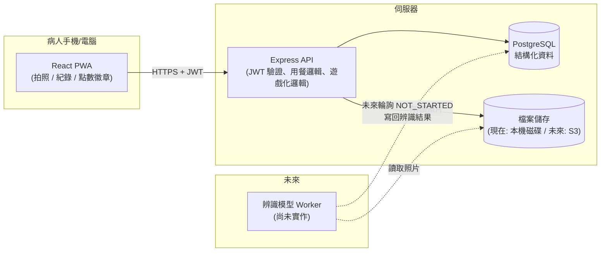

# 系統架構說明

這份文件說明整個 App 的技術架構、為什麼這樣選型，以及未來要接上「食物辨識模型」
時應該怎麼接。資料庫欄位層級的詳細說明另外寫在 [DATABASE.md](./DATABASE.md)。

## 一句話總覽

**PWA 前端（拍照、記錄、遊戲化 UI）→ Express API（驗證、業務邏輯）→ PostgreSQL（結構化資料）+ 本機檔案系統（照片原始檔）**



## 為什麼選這個技術棧

這個專案的優先目標是「快速做出可以展示、可以真的拍照紀錄的 App」，同時保留研究
用資料庫的擴充性，所以選擇：

| 選型 | 用了什麼 | 為什麼 |
|---|---|---|
| 前端平台 | **PWA**（React + Vite + TypeScript，`vite-plugin-pwa`） | 不用上架 App Store/Play Store 就能讓病人「加到主畫面」像 App 一樣使用；瀏覽器的 `<input capture="environment">` 就能直接叫出手機相機，開發與展示都最快 |
| 後端 | **Node.js + Express + TypeScript** | 生態成熟、開發速度快，跟前端共用 TypeScript 型別觀念，降低專題團隊的學習成本 |
| 資料庫 | **PostgreSQL + Prisma ORM** | 關聯式資料庫最適合這種「病人-用餐-照片-辨識結果」高度結構化、彼此有明確關聯的資料；Prisma 讓 schema 即文件、migration 自動產生，也方便未來老師/口委看 schema 就懂資料設計 |
| 照片儲存 | **本機磁碟（抽象成 `StorageService` 介面）** | 現階段不需要雲端費用與設定；`StorageService` 介面已經把「存檔案」這件事抽象出來，未來要換成 S3 / GCS，只要新增一個實作該介面的 class，其餘程式碼完全不用改（見 `backend/src/services/storage.service.ts`） |
| 開發/執行環境 | **Docker Compose**（db + backend + frontend 三個服務） | 你的電腦目前沒裝 Node.js，用 Docker 可以不用另外安裝 Node/PostgreSQL，一個指令就把整個環境跑起來，且跟未來部署到伺服器時的環境一致 |

## 資料夾結構

```
claude_app/
├─ docker-compose.yml       # 一鍵啟動 db + backend + frontend
├─ backend/
│  ├─ prisma/schema.prisma  # 資料庫schema（唯一的資料表定義來源）
│  ├─ prisma/seed.ts        # 徽章目錄初始資料
│  └─ src/
│     ├─ routes/            # HTTP 路由：auth / meals / photos / gamification / profile
│     ├─ services/          # 商業邏輯：photo 處理、storage 抽象、gamification 規則
│     ├─ middleware/        # JWT 驗證、上傳限制、錯誤處理
│     └─ index.ts           # Express app 進入點
└─ frontend/
   └─ src/
      ├─ pages/              # 登入/註冊/首頁/新增用餐/歷史紀錄/個人頁
      ├─ components/         # 拍照元件、徽章格、底部導覽列…
      ├─ api/                # 呼叫後端 API 的 client（含 JWT 自動 refresh）
      └─ store/               # 前端狀態（登入狀態、Toast 提示）
```

## 認證機制

- Email + 密碼註冊/登入，密碼用 bcrypt 雜湊。
- 簽發 **access token**（15 分鐘過期，放在記憶體/localStorage，每次 API 請求帶上）
  與 **refresh token**（30 天過期，存在資料庫 `refresh_tokens` 表，可被撤銷）。
- access token 過期時，前端 API client 會自動用 refresh token 換一組新的，使用者不會感覺到中斷。
- `User.role` 欄位預留 `RESEARCHER` / `ADMIN` 角色，之後要做「研究人員後台」查看多位病人資料時，
  不需要改資料庫 schema，只要在對應 API 加上角色檢查即可。

## 一次用餐的完整流程（核心功能）

1. 病人在首頁按「開始記錄一餐」→ 選擇餐別（早/中/晚/點心）→ 拍**餐前照**
   → 呼叫 `POST /api/meals/pre-meal`：建立一筆 `MealRecord`（狀態 `AWAITING_POST_PHOTO`），
   同時把照片存起來、記錄拍照時間/像素等中繼資料，並發放「餐前紀錄」點數。
2. 病人吃完飯後回到 App，看到首頁「進行中的用餐」卡片（會顯示已經過了多久），
   按「拍餐後照」→ 呼叫 `POST /api/meals/:id/post-meal`：存下餐後照，計算
   `postMealAt - preMealAt` 得到 **用餐時長**，把狀態改成 `COMPLETED`，
   並觸發遊戲化邏輯（點數、連續天數、徽章）。
3. 所有拍過的照片都能在「紀錄」頁用縮圖回顧。

## 遊戲化設計

規則全部集中在 `backend/src/services/gamification.service.ts`，方便之後調整：

- **點數**：拍餐前照 +10、完成餐後照 +15、一天內完成早午晚三餐 +20 bonus、
  達成連續天數里程碑另有加碼、獲得徽章 +25。所有加點都寫進 `PointsLedgerEntry`
  這張「只增不改」的事件表，總點數 = 加總，同時保留完整行為歷程。
- **連續天數（streak）**：依照病人裝置回報的時區，判斷「今天」是否已經完成過
  至少一餐，逐日累加或中斷重置，存在 `UserStreak`。
- **徽章**：里程碑式設計（第一餐、連續3/7/14/30/60/100天、完美的一天、
  累計10/50/100/200餐、早餐達人…），由 `prisma/seed.ts` 建立徽章目錄，
  達成條件時寫入 `UserBadge`。
- 前端在完成餐後照時會比對「上傳前/上傳後」的徽章清單，抓出**新獲得**的徽章，
  用慶祝畫面呈現，並搭配每次都會換一句的鼓勵文案（純前端靜態內容，不用進資料庫）。

## 為未來的辨識功能預留了什麼

現在完全沒有寫任何辨識邏輯，但資料庫與 API 已經替未來鋪好路：

1. 每張 `Photo` 上傳時都會自動建立一筆 `NutritionEstimate`，狀態是 `NOT_STARTED`。
2. 未來選定模型後，只需要新增一個「背景 worker」：定期把 `NOT_STARTED` 的照片抓出來、
   丟給模型、把結果（鈉/鉀/磷/蛋白質/熱量、信心分數、原始輸出）寫回同一筆
   `NutritionEstimate`，狀態改成 `COMPLETED`（或失敗時 `FAILED`）。
3. 前端 / 既有 API 完全不需要改動，因為資料表與關聯已經存在；只是現在沒有東西會把
   狀態從 `NOT_STARTED` 改變而已。
4. `PatientProfile` 已經有每日鈉/鉀/磷攝取上限欄位，未來辨識出攝取量後，就可以直接
   拿來比對「今天有沒有超標」，不需要另外設計欄位。

## 尚未實作、但資料庫設計時已經考慮到的擴充方向

- **檢驗數據表（LabResult）**：未來若要收集病人的血液檢驗值（血鉀、血磷等）跟飲食
  紀錄做相關性分析，可以直接新增一張 `LabResult`（userId、抽血日期、各項數值），
  透過 `userId` 就能 join 到現有的 `MealRecord` / `NutritionEstimate`，不需要動到
  現有 schema。
- **研究人員後台**：`User.role` 已經有 `RESEARCHER`，未來要讓研究人員瀏覽/匯出多位
  病人的資料，只要新增對應的 API + 前端頁面，資料庫不需要遷移。
- **雲端照片儲存**：只要實作 `StorageService` 介面的 S3 版本並替換
  `storageService` 的實例化方式即可，`Photo.storageKey` 已經是「與儲存位置無關」
  的相對路徑設計。
