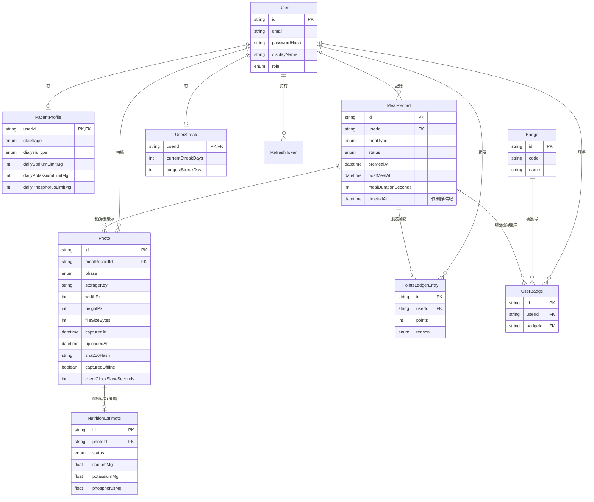

# 資料庫設計說明

完整定義在 [backend/prisma/schema.prisma](../backend/prisma/schema.prisma)，這份文件解釋
「為什麼這樣設計」。資料庫是 PostgreSQL，透過 Prisma migration 管理版本。

## ER 圖



## 各資料表的設計理由

### `User` / `RefreshToken`
基本帳號資訊與登入機制。`role` 欄位現在只用 `PATIENT`，但先預留 `RESEARCHER` /
`ADMIN`，之後要做「研究人員登入看多位病人資料」的後台時，不需要改 schema。

### `PatientProfile`（病人臨床背景）
跟 `User` 拆開成獨立資料表，是因為帳號資訊（登入用）跟臨床資訊（研究/飲食建議用）
的變動頻率、隱私等級都不一樣，分開管理比較乾淨。

重點欄位：
- `ckdStage`、`dialysisType`：慢性腎臟病分期與透析狀態。這是腎臟飲食限制最關鍵的
  分層依據（不同分期、有無透析，鈉鉀磷的建議攝取量完全不同），未來做「個人化飲食
  建議」一定會用到，也是研究分析時最重要的分組變數。
- `dailySodiumLimitMg` / `dailyPotassiumLimitMg` / `dailyPhosphorusLimitMg`：
  單位統一用 **mg**（磷/鈉/鉀在臨床上都是以毫克計算），`dailyProteinLimitG` 用
  **g**、`dailyFluidLimitMl` 用 **ml**。統一單位是為了避免未來不同來源的資料
  （病人自填 vs. 辨識模型輸出）混用單位造成分析時的數據污染。

### `MealRecord`（一次用餐）
這是核心實體。一筆 `MealRecord` = 一次用餐事件，狀態機只有三態：

```
AWAITING_POST_PHOTO --(補上餐後照)--> COMPLETED
AWAITING_POST_PHOTO --(病人主動放棄)--> ABANDONED
```

`preMealAt` / `postMealAt` 分別對應餐前/餐後照片的拍攝時間，`mealDurationSeconds`
在完成當下計算好存起來（而不是每次查詢都重算），原因是：
1. 查詢列表時效能較好（不用每筆都算時間差）。
2. 「用餐時長」本身就是一個有研究價值的行為指標（例如：用餐時間過短可能代表
   狼吞虎嚥，這跟腎臟病人的飲食衛教也有關），先固化下來比較好做統計。

**`id` 可以由前端指定**：`@default(uuid())` 代表沒給值時資料庫會自動產生，但
`POST /api/meals/pre-meal` 允許前端在建立時就指定這個 UUID。這是為了支援前端
的離線優先設計（見 [ARCHITECTURE.md](./ARCHITECTURE.md) 的「離線優先設計」）：
病人離線拍照當下就要能建立一筆完整可用的紀錄，沒辦法等伺服器回應才知道 ID。
搭配 `Photo` 的 `unique(mealRecordId, phase)` 限制，同一個 ID 重複送出同一張
照片會被視為「同一個請求重送」而不是新紀錄，讓網路不穩時的重試變得安全。

**軟刪除（`deletedAt`）**：病人在 App 上刪除一筆紀錄時，只會把 `deletedAt` 設成
刪除當下的時間，資料庫的紀錄、照片檔案都不會真的被清掉。所有一般查詢（列表、
詳情頁）都會加上 `deletedAt: null` 的過濾條件，所以病人看起來紀錄真的消失了；
但這筆紀錄已經觸發過的點數/連續天數/徽章不會被追討回去——這些是「病人當下確實
做了這個行為並得到獎勵」的歷史事實，不會因為之後刪除紀錄而改變。未來研究人員
要做完整資料分析時，只要查詢時不加這個過濾條件，就能看到含已刪除紀錄的完整資料。

### `Photo`（照片 + 完整技術中繼資料）
這張表刻意記錄得比「目前功能」需要的更詳細，因為**這些欄位在辨識模型還沒選定的
階段最有研究價值**：

| 欄位 | 用途 |
|---|---|
| `widthPx` / `heightPx` | 像素尺寸。⚠ 自從前端加上上傳前壓縮之後，這裡記錄的是**壓縮後**的尺寸（最長邊固定 1600px），所以已經無法再用它分析「照片解析度是否影響辨識準確率」。若研究上需要這個變因，要另外加欄位記錄原始尺寸 |
| `fileSizeBytes` / `mimeType` | 檔案格式與大小，有助於了解病人實際拍照的裝置/畫質分布 |
| `sha256Hash` | 內容雜湊，可偵測重複上傳、驗證檔案完整性 |
| `capturedAt` | 前端在「使用者選定照片的當下」記錄的時間戳（見下方「已知限制」） |
| `uploadedAt` | 伺服器收到檔案的時間，跟 `capturedAt` 的差可以看出「離線後補傳」的情形 |
| `clientTimezoneOffsetMin` | 裝置當下的時區偏移，用來把 UTC 時間換算回病人的「當地日期」，這樣連續天數/每日三餐的判斷才會符合病人的實際作息，而不是被 UTC 日期邊界誤判 |
| `capturedOffline` | 前端自己回報「這張照片是沒網路時拍下、排隊等待上傳的」，研究時可用來區分離線補傳的資料 |
| `clientClockSkewSeconds` | 上傳當下（伺服器收到時間 − 裝置回報的送出時間）。正值＝手機時鐘偏慢、負值＝偏快。`capturedAt` 等時間戳是裝置時鐘的**原始值、不會被修正**，分析時可用這個欄位自行估算修正量；用餐「時長」是同一個時鐘的兩個時間相減，不受時鐘偏差影響 |
| `deviceUserAgent` | 裝置/瀏覽器資訊，用於分析照片品質差異的來源 |
| `storageKey` | 檔案在儲存系統內的相對路徑，不寫死儲存供應商，方便未來從本機磁碟換成雲端物件儲存 |

**唯一限制**：同一筆用餐紀錄的同一個階段（餐前/餐後）只能有一張照片
（`unique(mealRecordId, phase)`）。離線補傳時，手機可能在「伺服器處理完」與「收到回應」
之間斷線而重送同一個請求，這個限制加上內容雜湊比對，保證重送不會產生重複資料。

**隱私考量**：資料庫刻意「不」儲存原始 EXIF（尤其是 GPS 定位資訊），避免意外記錄到
病人的居住地址等敏感位置資料。

而且現在**連傳都不會傳上來**：前端在上傳前會壓縮照片，過程中用 canvas 重新編碼，
原始 EXIF 整段會被移除，所以含 GPS 的原始中繼資料根本不會離開病人的手機。
這比「伺服器收到後不解析」更安全一層，也完成了 IRB 要求的照片去識別化。

如果未來研究需要粗粒度的地理資訊（例如「外食 vs. 在家吃」），建議用病人自己填寫的
標籤，而不是從 EXIF 反推。另外，**若之後要改用 EXIF 的拍攝時間，必須在前端壓縮之前
讀取**，否則資訊已經被移除。

### `NutritionEstimate`（辨識結果 — 目前完全是空的預留表）
每張照片上傳時都會自動建立一筆，狀態預設 `NOT_STARTED`。現階段**沒有任何程式
會去改動這張表的內容**，但先建好的好處是：
- 未來接上模型時，`Photo` ↔ `NutritionEstimate` 的關聯已經存在，不需要 migration。
- `status` 欄位（`NOT_STARTED` / `PROCESSING` / `COMPLETED` / `FAILED`）讓未來的
  背景 worker 可以直接查詢「還沒處理的照片」。
- `modelName` / `modelVersion` 讓你可以在同一張表裡比較不同模型版本的表現，
  這對「還沒決定要用哪個辨識模型」的現況特別重要。
- `rawModelOutput`（JSON）保留模型原始輸出，即使之後修正了單位換算邏輯，也能
  回頭用原始資料重新計算，不會丟失資訊。

### `PointsLedgerEntry`（點數帳本）
採用**事件溯源（event-sourced）**設計：只會 INSERT，不會 UPDATE/DELETE。
好處：
1. 總點數永遠是 `SUM(points)`，邏輯簡單、不會跟其他地方的狀態打架。
2. 完整保留「什麼時候、為什麼」得到點數的歷程，這本身就是一份「病人使用行為」
   的研究資料（例如：分析點數/徽章制度是否真的提升了病人的紀錄依從性）。

### `UserStreak`
只存「目前狀態」（目前連續天數、最長連續天數、上次計算的日期），不用每次都
掃描全部 `MealRecord` 重新計算，是效能考量。真正的判斷邏輯在
`gamification.service.ts`。

### `Badge` / `UserBadge`
`Badge` 是徽章目錄（由 `prisma/seed.ts` 建立，不是病人產生的資料），`UserBadge`
記錄「誰在什麼時候達成了哪個徽章」，並用 `unique(userId, badgeId)` 確保同一個
徽章不會重複發放。

## 未來新增資料表的建議（目前尚未建立）

這些不是現在就要做的功能，但目前的 schema 設計時已經預留了空間，未來加入時
不會動到現有資料：

- **`LabResult`**（檢驗數據）：`userId`、抽血日期、血鈉/血鉀/血磷/肌酸酐等數值。
  跟 `MealRecord` 一樣用 `userId` 關聯，就能分析「飲食紀錄 vs. 檢驗結果」的相關性。
- **`ClinicianNote`**（衛教師/醫師備註）：如果未來有醫護人員帳號要留言給病人。

## 資料匯出 / 研究分析建議

由於是關聯式資料庫，未來要做研究分析時，可以直接用 SQL 或 Prisma 把
`MealRecord` + `Photo` + `NutritionEstimate` join 起來，依 `userId` 分組，
匯出成 CSV 餵給統計工具（R / Python pandas）。所有時間欄位都是標準的
`timestamptz`，換算時區、跨病人比較都不會有問題。
