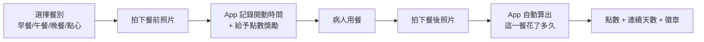
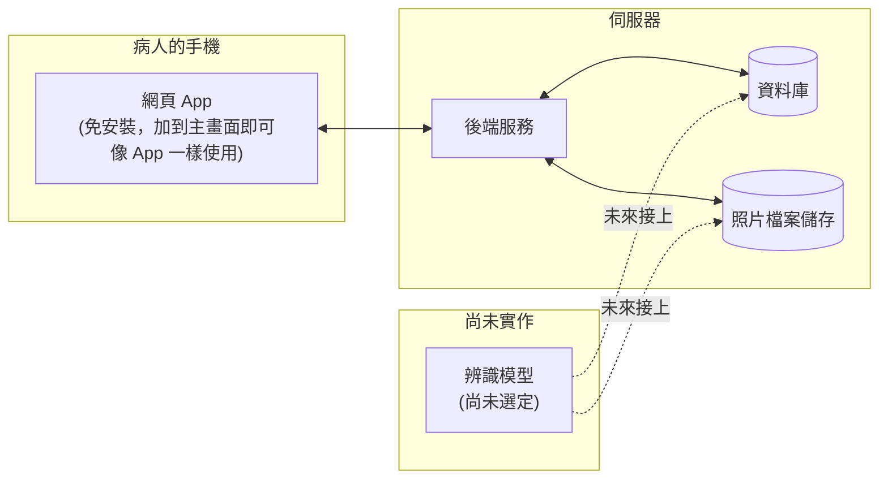

# 腎臟病飲食紀錄 App — 開發進度報告

> 報告日期：2026-09-11
>
> ⚠️ **這是 9/11 當天的進度快照。** 之後陸續完成了離線優先設計、Android APK、
> 試用模式、月曆紀錄頁、照片存進手機相簿、忘記密碼等功能——
> **最新進度請看 [MEETING_0930.md](./MEETING_0930.md) 或
> [README 的「目前狀態」](../README.md)**，不要以這份報告為準。
> 專題目標：協助慢性腎臟病 (CKD) 病人記錄三餐，未來能自動辨識鈉、鉀、磷攝取量並給予飲食建議。**現階段完成的是「拍照記錄飲食」這個核心功能**，辨識模型尚未選定、之後再接。

---

## 1. 為什麼先做「拍照紀錄」而不是先做辨識

腎臟病飲食衛教最大的困難之一，是病人很難長期、準確地記錄自己吃了什麼。與其一開始就賭在某一個辨識模型上，我們先把「病人願不願意持續紀錄」這件事解決：

- 先讓病人**養成拍照紀錄三餐的習慣**（用遊戲化機制吸引他們持續使用）
- 同時把每張照片的**時間、影像品質等中繼資料**都完整存下來
- 資料庫從一開始就**預留辨識結果要存放的位置**，等之後選定模型，直接接上即可，不需要重新設計資料庫或請病人重新開始使用

換句話說：**這個階段是在為未來的辨識功能，同時打好「病人願意用」跟「資料存得對」這兩個地基。**

---

## 2. 病人實際的使用流程

- **為什麼要拍兩張（餐前+餐後）**：單靠一張照片沒辦法知道「病人吃了多久」。用餐時長本身也是有意義的行為指標（例如吃太快、吃太久都可能反映不同的飲食狀況），先讓 App 準確記錄下來，之後才有資料可以分析。
- **忘記拍餐後照怎麼辦**：首頁會顯示「進行中的用餐」提醒卡片，附上即時計時器，提醒病人回來完成紀錄；病人也可以選擇放棄這筆紀錄。

---

## 3. 用遊戲化留住病人

長期記錄飲食是一件枯燥的事，所以我們刻意加入了幾種「情緒價值」設計，目標是提高病人持續使用的意願：

| 機制 | 說明 |
|---|---|
| **點數** | 拍餐前照 +10、完成餐後照 +15、一天內三餐都拍完 +20 獎勵分 |
| **連續紀錄天數** | 依病人手機的當地時區計算「今天有沒有記錄」，逐日累加，中斷就重置，並在畫面上用 🔥 呈現 |
| **徽章** | 13 種里程碑徽章（第一次紀錄、連續 3/7/14/30/60/100 天、早餐達人、累計 10/50/100/200 餐、完美的一天…） |
| **完成慶祝畫面** | 拍完餐後照後，會顯示這一餐花了多久、獲得多少點數、有沒有解鎖新徽章，並隨機顯示一句鼓勵文案 |

這些機制的點數/徽章紀錄本身也會被完整保留（詳見第 5 節），未來也能拿來分析「什麼樣的獎勵機制真的能提升病人的紀錄依從性」。

---

## 4. 系統架構（給非技術背景的簡化版）

- 病人不需要下載、安裝 App，用手機瀏覽器打開連結、「加到主畫面」，使用體驗跟一般 App 幾乎一樣。
- 技術細節（資料庫每張表的欄位設計、為什麼選這套技術、未來要怎麼擴充）整理在另外兩份技術文件中，供之後接手開發的人參考：`docs/ARCHITECTURE.md`、`docs/DATABASE.md`。

---

## 5. 資料是怎麼被記錄與保護的

因為這是病人的健康資料，這部分特別謹慎設計，也是這次想跟老師特別說明的重點：

- **每張照片會記錄**：拍攝時間、上傳時間、像素尺寸、檔案大小、裝置時區、裝置資訊、內容雜湊值——這些現在看起來「用不到」的中繼資料，其實是未來評估辨識模型準確率、分析病人拍照習慣時最有價值的部分。
- **刻意不記錄的資料**：不解析照片的 GPS 定位資訊，避免意外存下病人的居住地點等敏感位置資料。
- **病人可以刪除自己的紀錄**：病人若不想再看到某一筆紀錄，可以自行刪除。但採用「軟刪除」設計——病人看起來紀錄消失了，資料庫與照片檔案仍完整保留供研究分析使用；已經獲得的點數/徽章也不會因此被收回。未來若有病人正式撤回研究同意，還是可以由研究端手動做完整清除。
- **權限控管**：病人只能看到自己的照片與紀錄，看不到其他病人的資料。

> 目前這些設計都還沒有實際收案（現在只有測試帳號），但已經預先按照「未來會有真實病人資料」的規格在做，正式收案前建議再跟醫院 IRB 確認資料存放地點與同意書內容。

---

## 6. 目前完成度

| 功能 | 狀態 |
|---|---|
| 帳號註冊/登入 | ✅ 完成 |
| 餐前/餐後拍照紀錄、自動算用餐時長 | ✅ 完成 |
| 照片中繼資料記錄 | ✅ 完成 |
| 點數／連續天數／徽章 | ✅ 完成 |
| 病人刪除自己的紀錄（軟刪除） | ✅ 完成 |
| 病人健康背景資料（CKD 分期、透析狀態、鈉鉀磷每日上限） | ✅ 完成 |
| 歷史紀錄回顧 | ✅ 完成（9/26 後改成月曆，可點進某一天看照片） |
| 食物辨識（鈉/鉀/磷估算） | ⬜ 尚未開始，資料庫已預留欄位 |
| 正式雲端部署（讓病人隨時隨地使用） | ⬜ 規劃中 |
| 衛教師/研究人員後台 | 🔸 9/26 後做了第一個功能：衛教師可以幫病人開密碼重設代碼。看多位病人資料的後台仍未開始 |

---

## 7. 下一步規劃

1. **選定並接上食物辨識模型**：資料庫已預留位置，接上時不需要更動現有資料或病人的使用流程。
2. **正式部署**：目前僅在開發環境測試，正式讓病人在家使用前，需要決定主機／網域，並依醫院規範處理資料存放。
3. **簡化病人登入方式**：目前用 email + 密碼，之後可能改成衛教師預先建立帳號、病人用簡單代碼登入，降低操作門檻。
   （9/26 後已先做了相關的一半：病人忘記密碼時，衛教師可以當面開一組代碼給他。）
4. **提醒推播**：目前只有 App 內的提醒卡片，之後可加入「忘記拍餐後照」的主動推播通知。

---

*本報告由開發過程中即時整理，如需技術細節（資料庫 ER 圖、API 設計等）請參考同一專案下的 `docs/ARCHITECTURE.md` 與 `docs/DATABASE.md`。*
